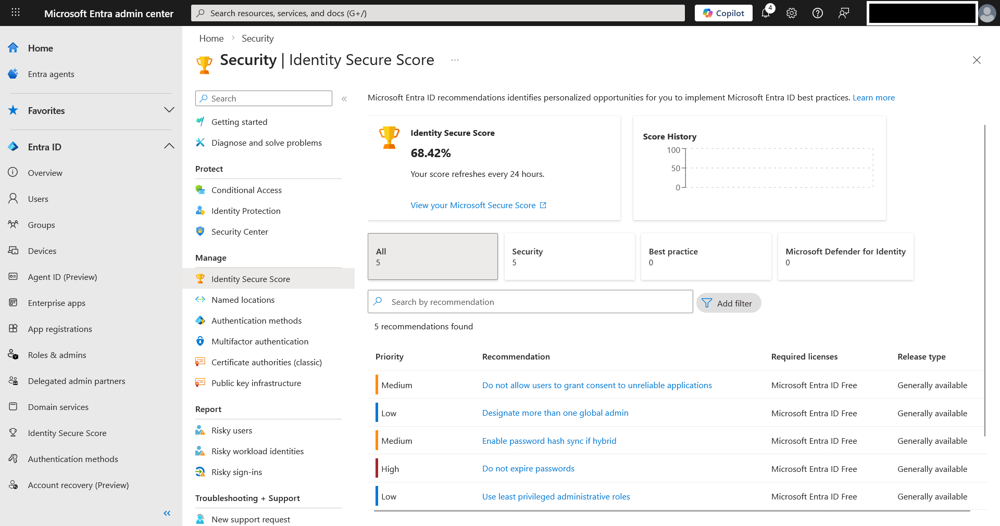
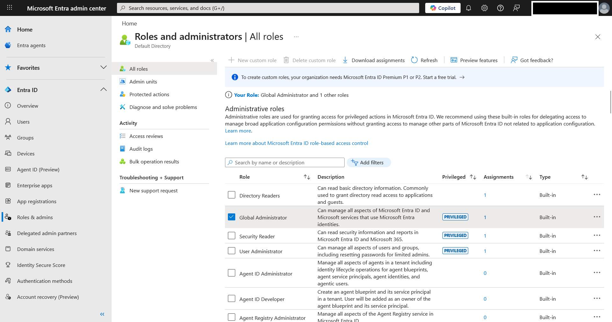
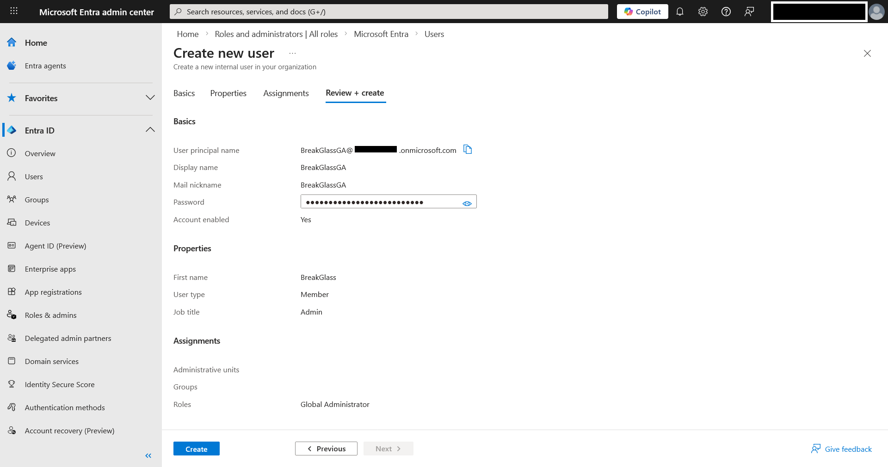
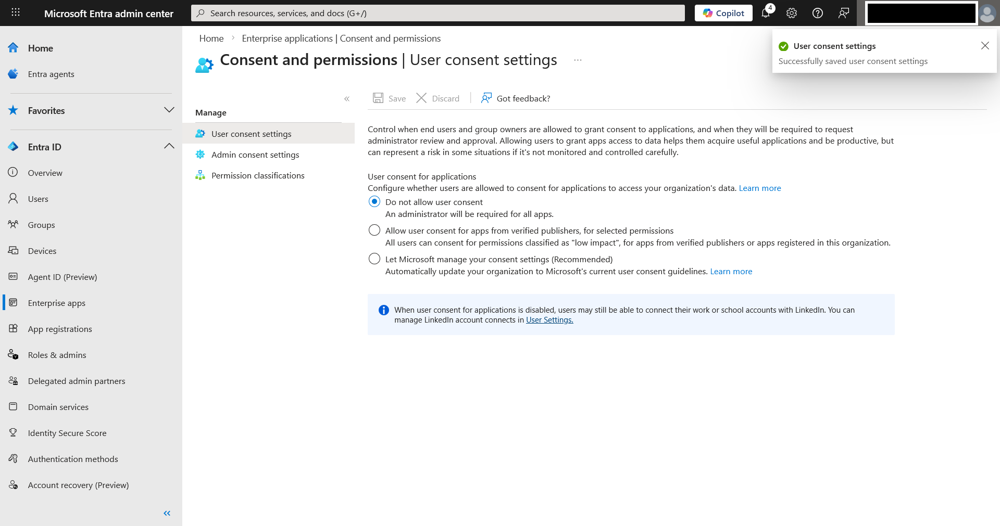
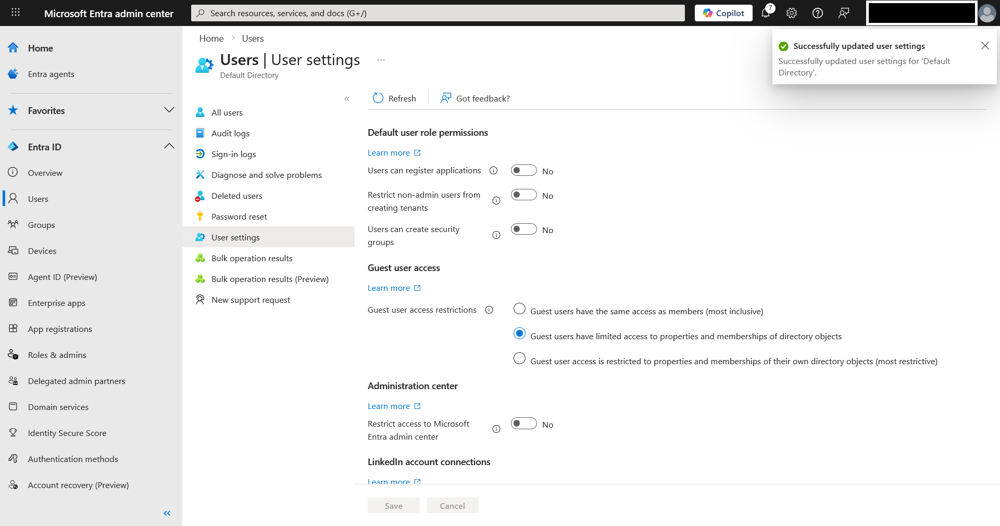
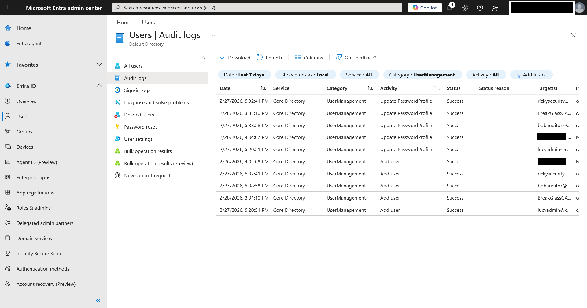

# Azure AD Identity Hardening

## Objective

This lab builds on the Azure AD tenant configured in Lab 01 by introducing targeted identity hardening controls at the administrative and tenant level.

The goal was to evaluate the tenant from a risk-reduction perspective and implement targeted controls within the constraints of the Azure AD Free tier.

---

## Baseline Assessment

As an initial reference point, the Microsoft Identity Secure Score was reviewed to understand the default posture of the tenant.

Secure Score was treated as a baseline indicator rather than a compliance framework. While it provides Microsoft-aligned recommendations, identity posture should also be evaluated against broader principles such as least privilege, Zero Trust, and industry benchmarks like CIS and NIST guidance.

---

## Administrative Role Review

Administrative roles were reviewed to confirm that no unnecessary privileged assignments existed.

The tenant was operating with minimal role sprawl, consistent with the principle of least privilege.

---

## BreakGlassGA – Emergency Access Account

To improve administrative resilience, a dedicated emergency access account was created:

**Account Name:** `BreakGlassGA`  
**Role Assigned:** Global Administrator  

### Password Strategy

The password for `BreakGlassGA` was generated as a high-entropy passphrase aligned with **NIST SP 800-63B** guidance:

- Multi-word passphrase
- Combination of uppercase and lowercase characters
- Included numeric characters
- Emphasis on length and entropy over arbitrary complexity rules

This approach aligns with modern identity guidance favoring strong, memorable passphrases over short complex strings.

The account is cloud-only and intended strictly for emergency administrative recovery scenarios.

---

## Tenant Hardening Controls

### 1. User Consent Restrictions

User consent to applications was restricted to reduce the risk of malicious OAuth app abuse and token-based persistence attacks.

This limits the ability of standard users to grant excessive permissions to third-party applications.

---

### 2. Application Registration Disabled

Default tenant behavior allowing users to register applications was disabled.

### 3. Security Group Creation Disabled

The ability for non-admin users to create security groups was also disabled.

These changes reduce:

- Shadow IT risks
- Rogue application registrations
- Privilege escalation via self-created groups
- Uncontrolled identity object sprawl

---

## Audit Log Validation

Administrative actions were validated using Azure AD Audit Logs to confirm control-plane visibility and accountability.

This step reinforces governance visibility and administrative accountability within the tenant.

---

## Security Principles Applied

This lab intentionally applied foundational security concepts:

- **Least Privilege** – No unnecessary role assignments
- **Administrative Isolation** – Dedicated emergency access account
- **Attack Surface Reduction** – Restricting app registration and group creation
- **Zero Trust Awareness** – Reducing implicit trust in user-driven consent flows
- **Traceability** – Audit log validation of privileged actions

The objective was controlled hardening, not feature accumulation.

---

## Risk Reduction Summary

The following identity risks were reduced:

- Privilege sprawl from excessive role assignments  
- OAuth consent abuse by standard users  
- Rogue application registration  
- Unauthorized group-based privilege escalation  
- Lack of emergency administrative recovery path  

The tenant now reflects a more controlled administrative posture while remaining within Free-tier capabilities.

---

## Scope & Licensing Considerations

Certain advanced identity protections (e.g., Conditional Access, Privileged Identity Management, and configurable Self-Service Password Reset policies) require Azure AD Premium licensing and were intentionally excluded due to the Free-tier scope of this lab.

The focus remained on practical identity hardening within Azure AD Free.

---

## Conclusion

The emphasis of this lab was placed on reducing identity risk and strengthening control over administrative boundaries by applying structured administrative review, emergency access planning, tenant-level control restrictions, and audit validation.

---
