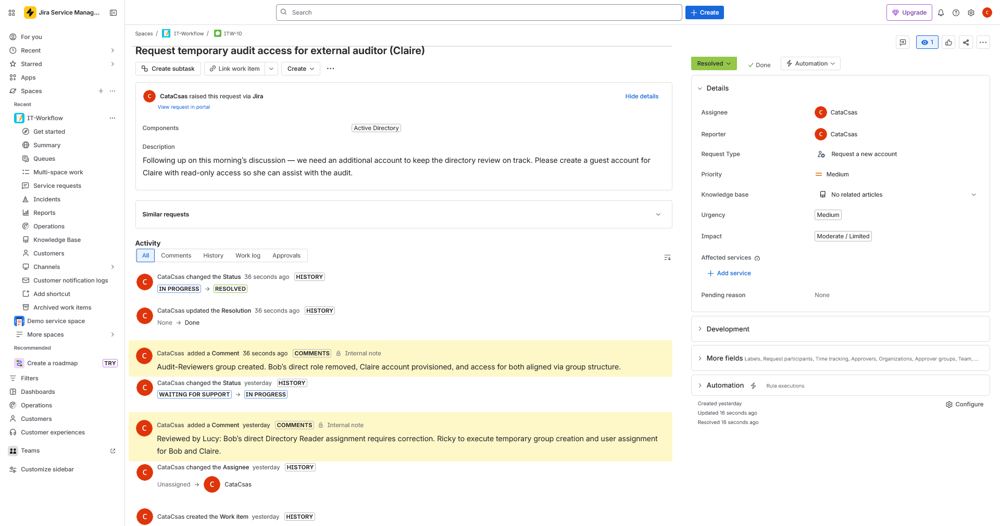
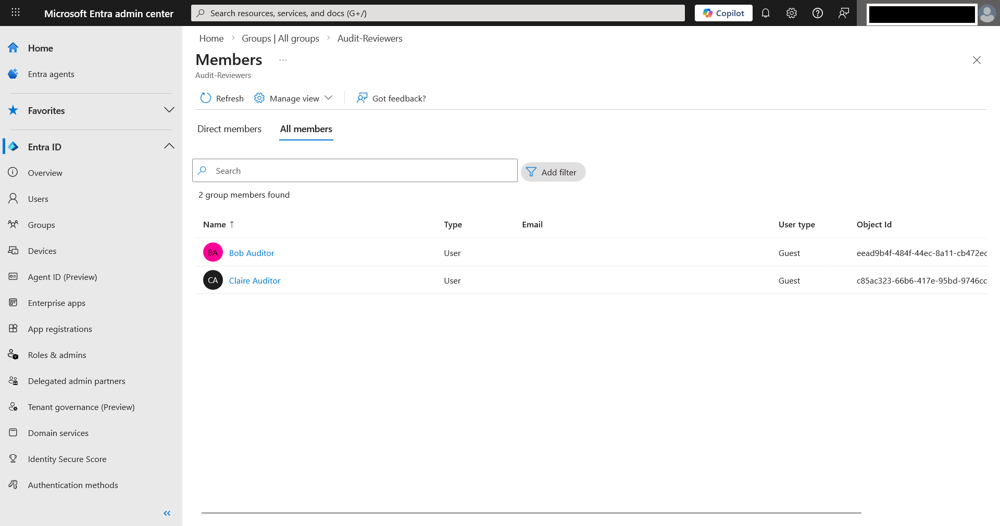
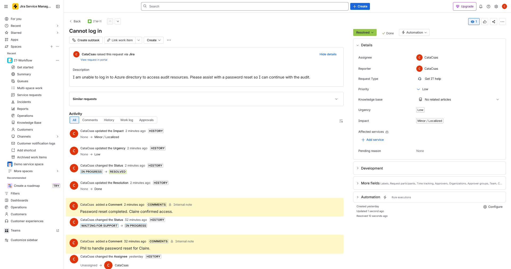
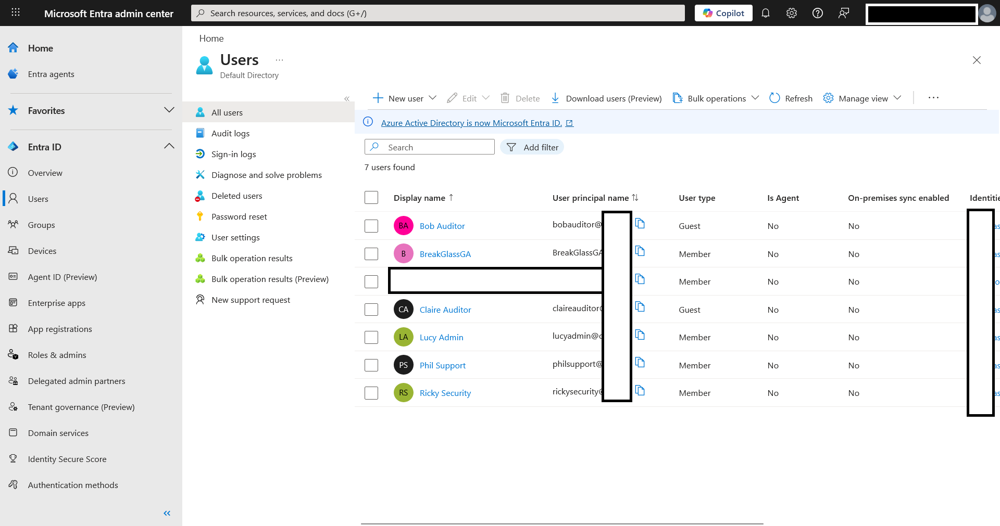

# Lab 03 – Microsoft Entra ID: Account Lifecycle Simulation

## Objective

This lab builds on the hardened Azure AD environment from Lab 02 by simulating a full identity lifecycle driven by operational requirements.

The objective was to demonstrate how identity governance, access provisioning, incident response, and access cleanup are executed within a structured workflow.

---

## Scenario

An ongoing audit required additional support to complete directory review activities within the expected timeframe.

Bob, an external auditor, required assistance to meet delivery deadlines, leading to a request for an additional auditor account.

---

## Access Request & Governance Review

A service request was submitted to provision access for an additional external auditor.

Lucy reviewed the request and identified an RBAC inconsistency:

- Bob held a direct Directory Reader role assignment

To correct this, Lucy instructed Ricky to standardize access using a group-based model and proceed with provisioning under that structure.

---

## RBAC Correction & Provisioning

Ricky implemented the required changes:

- Created group: `Audit-Reviewers`
- Removed Bob’s direct Directory Reader role assignment
- Created guest account: Claire
- Aligned audit access for Bob and Claire under the Audit-Reviewers group
- Added both users to `Audit-Reviewers`

Access was aligned under a consistent structure, removing direct role dependency.

---

## Operational Incident (ITSM)

Following provisioning, Claire was unable to access the environment.

An incident ticket was created to resolve the issue.

Ricky reviewed the incident and delegated the task to Phil.

Phil performed a password reset; access was confirmed.

A temporary password was issued and communicated via a separate channel, with a required password change upon first login.

---

## Identity State

The environment during audit operations included administrative, operational, and temporary audit identities.

### Group Ownership & Membership

| Group | Owner | Members |
|------|------|--------|
| User-Administrators | Lucy | Lucy |
| Security-Operations | Ricky | Ricky |
| Security-Support | Ricky | Phil |
| Audit-Reviewers | Lucy | Bob, Claire |

This structure reflects separation of responsibilities and controlled access assignment.

---

## Access Cleanup

After completion of audit activities:

- Claire’s guest account was disabled
- Bob’s audit access was removed
- `Audit-Reviewers` group was cleared

The environment was returned to its baseline state.

---

## Identity Lifecycle Demonstrated

- Access request and approval (ITSM-driven)
- Governance review and RBAC correction
- Account provisioning and access alignment
- Incident response and delegation (ITSM-driven)
- Access deprovisioning and cleanup

---

## Security Principles Applied

- **Least Privilege** – Removal of direct role assignment
- **Access Standardization** – Group-based structure
- **Separation of Duties** – Governance, operations, and support roles
- **Traceability** – Ticket-driven actions and resolution
- **Lifecycle Management** – Temporary access revoked after use

---

## Conclusion

This lab demonstrates how identity management operates as a continuous process, integrating governance, operational response, and controlled access management within a structured workflow.

---
